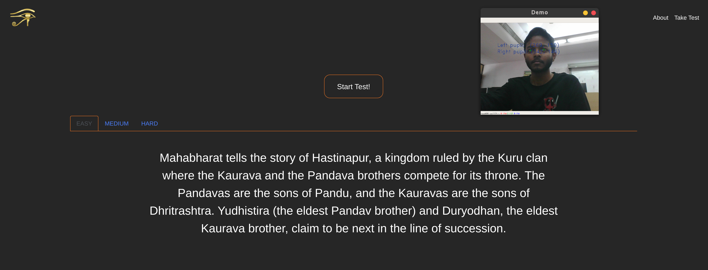
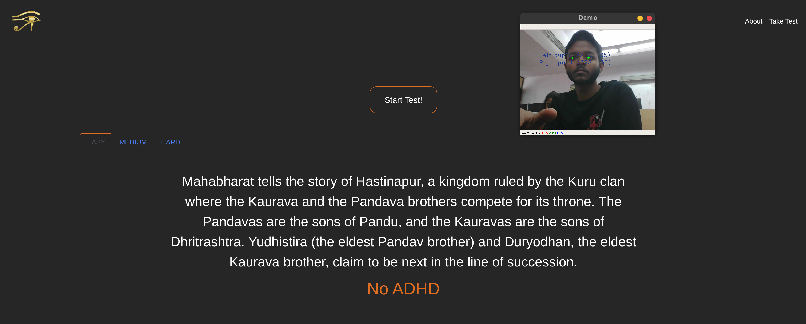

# ADHD & Autism Detection System
<p align="center">

</p>

<p align="center">
The project aims early detection of 'Autism' & 'ADHD' through a web platform fueled by machine learning. 
</p>
<br><br>
<p align="center">

</p>
<br>

## Problem Addressed
It is estimated that 1 in 59 children have Autism. Early warning signs of potential development of autism are very useful, because the treatment procedures can be started earlier, thus decreasing the struggle of the child. Cheap, fast and easy methods for detecting early warning signs of these disorders of the neurological development of children are needful.

A chronic condition including attention difficulty, hyperactivity and impulsiveness. ADHD often begins in childhood and can persist into adulthood. It may contribute to low self-esteem, troubled relationships and difficulty at school or work. Symptoms include limited attention and hyperactivity. Treatments include medication and talk therapy.

## Solution
A free, web-based-application that uses a standard computer webcam to screen a child while reading a passage on the screen and recording fixation time while reading.

<br>
<br>

<table align="center">
   <tr>
      <th></th>
      <th></th>
   </tr>
</table>

<br>
<br>

## Approach
1. Get real-time info of user's eye movement using OpenCV.
2. Gather the co-ordinates of the pupil according to the viewport.
3. Plot a line graph for the co-ordinates.
4. Pass the resulting graph through CNN for classifying.
5. Displaying the test result.

## Project Structure
   - main.py :
      - embedding the machine learning model to flask
      - routing functions
   - templates/ :
      - frontend files
   - static/ :
      - media files
   - model/ :
      - pre-trained [pickle file](https://drive.google.com/file/d/1H8QTCgcqqnCtyf4rBOaC9hyLn2-1RSUZ/view)

## Dependencies
   - Flask
   - OpenCV
   - Tensorflow
   - Matplotlib
   - dlib
   - NumPy
   - PyTorch
   - Torchvision

## Detailed Installation & Execution Guide

### Prerequisites
1. Python 3.10 (recommended for compatibility with all packages)
2. Visual Studio Build Tools (for installing dlib)
3. A webcam
4. Git (for cloning the repository)

### Step 1: Environment Setup

1. **Install Python 3.10**
   - Download Python 3.10 from [Python's official website](https://www.python.org/downloads/release/python-3100/)
   - During installation, make sure to check "Add Python to PATH"

2. **Install Visual Studio Build Tools**
   - Download Visual Studio Build Tools from [Microsoft's website](https://visualstudio.microsoft.com/visual-cpp-build-tools/)
   - During installation, select "Desktop development with C++"

### Step 2: Project Setup

1. **Clone the Repository**
   ```bash
   git clone https://github.com/Kiettranquoc/ADHD-identification.git
   cd ADHD-identification
   ```

2. **Create and Activate Virtual Environment**
   ```bash
   # Create virtual environment
   python -m venv .venv

   # Activate virtual environment
   # On Windows:
   .venv\Scripts\activate
   # On Linux/Mac:
   source .venv/bin/activate
   ```

3. **Install Required Packages**
   ```bash
   pip install -r req.txt
   ```

4. **Install dlib**
   ```bash
   # If you have Visual Studio Build Tools installed:
   pip install dlib

   # If the above fails, try the pre-built wheel:
   pip install https://github.com/jloh02/dlib/releases/download/v19.22/dlib-19.22.99-cp310-cp310-win_amd64.whl
   ```

### Step 3: Running the Application

1. **Start the Flask Server**
   ```bash
   python main.py
   ```
   You should see output similar to:
   ```
   * Serving Flask app "main" (lazy loading)
   * Environment: production
   * Debug mode: on
   * Running on http://127.0.0.1:5000/
   ```

2. **Access the Application**
   - Open your web browser
   - Go to `http://localhost:5000`
   - You should see the main page of the application

### Step 4: Using the Application

1. **Select Test Type**
   - Choose between ADHD or Autism test
   - Each test has three difficulty levels: EASY, MEDIUM, and HARD

2. **Starting a Test**
   - Click the "Start Test" button
   - Allow camera access when prompted
   - Position yourself in front of the camera
   - Read the text displayed on screen
   - The application will track your eye movements

3. **Test Results**
   - After completing the test, results will be displayed
   - The system analyzes eye movement patterns to make predictions

## Troubleshooting Common Issues

1. **Camera Access Issues**
   - Make sure your webcam is properly connected
   - Check browser permissions for camera access
   - Try refreshing the page if camera doesn't initialize

2. **Package Installation Issues**
   - If dlib installation fails, ensure Visual Studio Build Tools are properly installed
   - Try using the pre-built wheel for dlib
   - Make sure you're using Python 3.10

3. **Application Not Starting**
   - Check if port 5000 is already in use
   - Ensure all dependencies are properly installed
   - Check the console for error messages

4. **Eye Tracking Issues**
   - Ensure good lighting conditions
   - Position yourself directly in front of the camera
   - Remove glasses if they cause reflections
   - Keep your head relatively still during the test

## Important Notes

1. The application requires a stable internet connection for initial setup
2. Good lighting conditions are essential for accurate eye tracking
3. The test results are for screening purposes only and should not be considered as medical diagnosis
4. Keep the browser window active during the test
5. Do not move too much during the test as it may affect eye tracking accuracy

## Contributing
Feel free to submit issues and enhancement requests!

## License
This project is licensed under the MIT License - see the LICENSE file for details.
